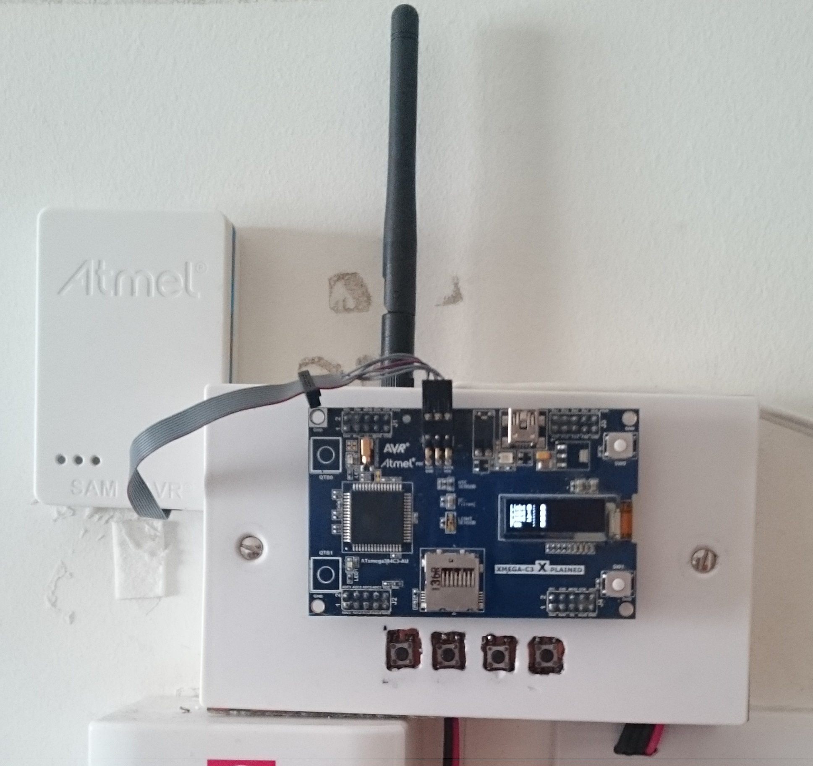

# Penguin

####THis unit is installed as a replacement to the traditional switching of the room. The Setup uses and Xmega382C3 microcontroller board, and NRF24L01+ for exchanging messages. The status of the relays are displayed on the GLCD (SSD1306). Powered by FreeRTOS

